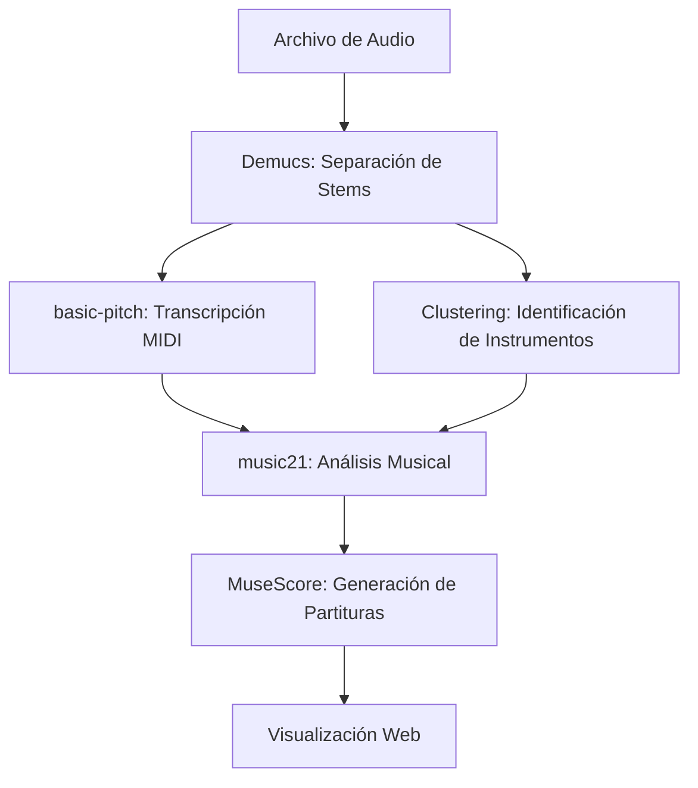

# 🎵 Song King v2.0

**Convierte tu música en partituras MIDI inteligentes con IA**

Song King es una aplicación web moderna que utiliza inteligencia artificial para separar stems de audio, transcribir melodías a MIDI y generar partituras profesionales automáticamente.

   

## ✨ Características

### 🎯 Funcionalidades Principales
- **Separación de Stems con IA** - Utiliza Demucs para separar voz, bajo, batería y otros instrumentos
- **Transcripción MIDI Inteligente** - Convierte audio a MIDI usando basic-pitch de Spotify
- **Clustering de Instrumentos** - Identifica automáticamente guitarra, piano y sintetizadores
- **Partituras Profesionales** - Genera partituras PNG de alta calidad con MuseScore
- **Interfaz Moderna** - Diseño responsivo tipo design engineer con componentes modernos

### 🔧 Tecnologías
- **Backend**: Flask, Python 3.10+
- **IA/ML**: Demucs, basic-pitch, music21
- **Frontend**: HTML5, CSS3 moderno, JavaScript ES6+
- **Diseño**: CSS Grid, Variables CSS, Gradientes modernos
- **Audio**: librosa, numpy, scipy
- **MIDI**: music21, mido
- **Partituras**: MuseScore integration

## 🚀 Instalación

### Prerrequisitos
- **Python 3.10** (recomendado) o 3.11 - **NO usar 3.12**
- Git
- FFmpeg  
- MuseScore 4
- CUDA (opcional, para mejor rendimiento con GPU)
- Al menos 4GB de RAM libre

### Ubuntu/WSL
```bash
# Clonar el repositorio
git clone https://github.com/tu-usuario/song-king.git
cd song-king

# Instalar dependencias del sistema
sudo apt update
sudo apt install python3-pip python3-venv ffmpeg

# Crear entorno virtual
python3 -m venv venv
source venv/bin/activate

# Instalar dependencias Python
pip install -r requirements.txt

# Instalar MuseScore
sudo apt install musescore4

# Ejecutar la aplicación
python app.py
```

### Windows
```cmd
# Clonar el repositorio
git clone https://github.com/tu-usuario/song-king.git
cd song-king

# Crear entorno virtual
python -m venv venv
venv\Scripts\activate

# Instalar dependencias
pip install -r requirements.txt

# Ejecutar la aplicación
python app.py
```

## 📖 Uso

1. **Iniciar la aplicación**
   ```bash
   python app.py
   ```

2. **Abrir en navegador**
   - Visita: `http://127.0.0.1:5000`

3. **Subir audio**
   - Soporta: MP3, WAV, M4A, FLAC
   - Tamaño máximo: 100MB

4. **Procesamiento automático**
   - Separación de stems (2-3 minutos)
   - Transcripción MIDI (1-2 minutos)
   - Clustering de instrumentos (30 segundos)
   - Generación de partituras (30 segundos)

5. **Explorar resultados**
   - Reproducir stems separados
   - Descargar archivos MIDI
   - Ver partituras generadas
   - Analizar estadísticas musicales

## 🎹 Pipeline de Procesamiento



### Archivos Generados
- `vocals.wav` - Stem de voz separado
- `bass.wav` - Stem de bajo separado  
- `drums.wav` - Stem de batería separado
- `other.wav` - Otros instrumentos
- `vocals_basic_pitch.mid` - MIDI de melodía vocal
- `bass_basic_pitch.mid` - MIDI de línea de bajo
- `other_cluster_0_guitar.mid` - MIDI de guitarra (clustering)
- `other_cluster_1_piano.mid` - MIDI de piano (clustering)
- `other_cluster_2_synth.mid` - MIDI de sintetizador (clustering)

## 🎨 Diseño Moderno

### Características del UI/UX
- **Design System** - Variables CSS consistentes
- **Tipografía** - Inter font con jerarquía clara
- **Colores** - Paleta moderna con gradientes
- **Componentes** - Cards, buttons, tabs responsivos
- **Animaciones** - Transiciones suaves y micro-interacciones
- **Accesibilidad** - Soporte para reducción de movimiento y alto contraste

### Responsive Design
- **Desktop** - Layout de 3 columnas optimizado
- **Tablet** - Layout de 2 columnas adaptativo  
- **Mobile** - Layout de 1 columna con navegación táctil

## 📡 API Endpoints

### Principales
- `POST /` - Subir y procesar archivo de audio
- `GET /api/job-status/<job_id>` - Estado del procesamiento
- `GET /api/score/<song>/<instrument>` - Información de partitura
- `GET /api/score/<song>/<instrument>/render` - Imagen de partitura

### Utilidades
- `GET /api/health` - Estado de salud de la aplicación
- `GET /api/stats` - Estadísticas generales
- `GET /api/musicxml/<song>` - Datos MusicXML completos

### Ejemplo de respuesta de salud
```json
{
  "status": "healthy",
  "version": "2.0.0",
  "components": {
    "upload_folder": true,
    "stems_folder": true,
    "musescore": true,
    "active_jobs": 0
  },
  "timestamp": 1640995200.0
}
```

## 🔧 Configuración Opcional - MuseScore (Para Partituras PNG)

Song King puede generar partituras en formato MusicXML (compatible con la mayoría de visualizadores) o PNG de alta calidad usando MuseScore.

### Windows/WSL
```bash
# Descargar MuseScore 4 desde: https://musescore.org/
# Instalar en C:\Program Files\MuseScore 4\
```

### Ubuntu/Debian
```bash
sudo apt update
sudo apt install musescore4
```

### macOS
```bash
# Descargar desde: https://musescore.org/
# O usar Homebrew:
brew install --cask musescore
```

**Nota:** Si MuseScore no está instalado, Song King funcionará perfectamente pero las partituras se generarán como MusicXML en lugar de imágenes PNG.

## ⚙️ Configuración

### Variables de Entorno
```bash
# Configuración de Flask
FLASK_ENV=development
FLASK_DEBUG=1

# Configuración de archivos
MAX_CONTENT_LENGTH=104857600  # 100MB
UPLOAD_FOLDER=uploads
STEMS_FOLDER=static/stems

# Configuración de Demucs
DEMUCS_MODEL=htdemucs
```

### Configuración de MuseScore
La aplicación detecta automáticamente MuseScore en estas ubicaciones:
- `/usr/local/bin/mscore-launcher` (Ubuntu/AppImage)
- `/usr/bin/musescore4` (Ubuntu/package)
- `C:\Program Files\MuseScore 4\bin\MuseScore4.exe` (Windows)
- `/Applications/MuseScore 4.app/Contents/MacOS/mscore` (macOS)

## 🔧 Desarrollo

### Estructura del Proyecto
```
song-king/
├── app.py                 # Aplicación Flask principal
├── config.py              # Configuración de la aplicación
├── tasks.py               # Tareas de procesamiento de audio
├── requirements.txt       # Dependencias Python
├── static/
│   ├── css/
│   │   └── modern.css     # Estilos modernos
│   ├── js/
│   │   └── vexflow.js     # Librería de notación musical
│   └── stems/             # Archivos procesados
├── templates/
│   └── index.html         # Template principal
├── uploads/               # Archivos subidos temporalmente
└── venv/                  # Entorno virtual
```

### Agregar Nuevas Características
1. **Nuevos modelos de IA**: Modificar `tasks.py`
2. **Nuevos endpoints**: Agregar en `app.py`
3. **Nuevos estilos**: Editar `static/css/modern.css`
4. **Nueva funcionalidad frontend**: Modificar `templates/index.html`

## 🐛 Resolución de Problemas

### Problemas Comunes

**Error: MuseScore no encontrado**
```bash
# Ubuntu
sudo apt install musescore4

# Verificar instalación
which musescore4
```

**Error: FFmpeg no encontrado**
```bash
# Ubuntu
sudo apt install ffmpeg

# Verificar instalación
ffmpeg -version
```

**Error: Memoria insuficiente**
- Reducir el tamaño del archivo de audio
- Cerrar otras aplicaciones
- Aumentar memoria virtual del sistema

**Error: Archivo muy grande**
- Máximo: 100MB
- Comprimir el audio antes de subir
- Usar formato MP3 en lugar de WAV

### Logs de Debugging
Los logs aparecen en la consola donde ejecutaste `python app.py`:
```
🎵 Iniciando Song King v2.0...
✨ Aplicación mejorada con diseño moderno
🚀 Servidor disponible en: http://127.0.0.1:5000
```

## 🤝 Contribuir

¡Las contribuciones son bienvenidas! Por favor:

1. Fork el repositorio
2. Crea una rama para tu feature (`git checkout -b feature/nueva-caracteristica`)
3. Commit tus cambios (`git commit -am 'Agregar nueva característica'`)
4. Push a la rama (`git push origin feature/nueva-caracteristica`)
5. Abre un Pull Request

### Áreas de Contribución
- 🎵 Nuevos modelos de separación de audio
- 🎼 Mejoras en transcripción MIDI
- 🎨 Mejoras de diseño y UX
- 📱 Optimizaciones móviles
- 🔧 Optimizaciones de rendimiento
- 📚 Documentación y tutoriales

## 📄 Licencia

Este proyecto está bajo la Licencia MIT - ver el archivo [LICENSE](LICENSE) para más detalles.

## 🙏 Agradecimientos

- **Demucs** - Por la excelente separación de fuentes de audio
- **basic-pitch** - Por la transcripción MIDI de alta calidad
- **music21** - Por las herramientas de análisis musical
- **MuseScore** - Por la generación de partituras profesionales
- **Flask** - Por el framework web simple y potente
- **Inter Font** - Por la tipografía moderna y legible

## 📊 Estadísticas del Proyecto

- **Líneas de código**: ~2,000+
- **Dependencias**: 15+ librerías especializadas
- **Formatos soportados**: MP3, WAV, M4A, FLAC
- **Instrumentos detectados**: 5+ tipos automáticamente
- **Tiempo de procesamiento**: 3-5 minutos por canción promedio

---

**Desarrollado con ❤️ para la comunidad musical**

¿Tienes preguntas? [Abre un issue](https://github.com/tu-usuario/song-king/issues) o [inicia una discusión](https://github.com/tu-usuario/song-king/discussions). 