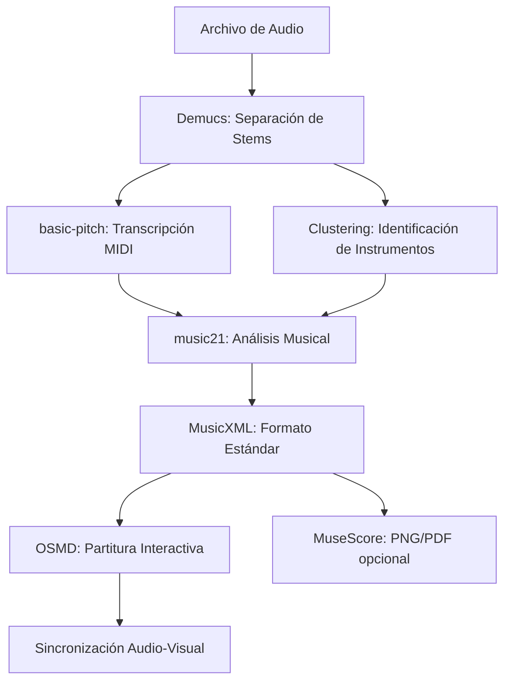

# 🎵 Song King v2.0

**Convierte tu música en partituras MIDI inteligentes con IA**

Song King es una aplicación web moderna que utiliza inteligencia artificial para separar stems de audio, transcribir melodías a MIDI y generar partituras profesionales automáticamente.

   

## ✨ Características

### 🎯 Funcionalidades Principales
- **Separación de Stems con IA** - Utiliza Demucs para separar voz, bajo, batería y otros instrumentos
- **Transcripción MIDI Inteligente** - Convierte audio a MIDI usando basic-pitch de Spotify
- **Clustering de Instrumentos** - Identifica automáticamente guitarra, piano y sintetizadores
- **Partituras Interactivas** - Visualización con OpenSheetMusicDisplay (OSMD) y VexFlow
- **Sincronización Audio-Partitura** - Seguimiento visual en tiempo real durante la reproducción
- **Interfaz Moderna** - Diseño responsivo tipo design engineer con componentes modernos

### 🔧 Tecnologías
- **Backend**: Flask, Python 3.10+
- **IA/ML**: Demucs, basic-pitch, music21
- **Frontend**: HTML5, CSS3 moderno, JavaScript ES6+
- **Partituras**: OpenSheetMusicDisplay (OSMD), VexFlow, MuseScore integration
- **Diseño**: CSS Grid, Variables CSS, Gradientes modernos
- **Audio**: librosa, numpy, scipy, Web Audio API
- **MIDI**: music21, mido

## 🚀 Instalación

### Prerrequisitos
- **Python 3.10** (recomendado) o 3.11 - **NO usar 3.12**
- Git
- FFmpeg  
- MuseScore 4 (opcional, para generación de PNG)
- CUDA (opcional, para mejor rendimiento con GPU)
- Al menos 4GB de RAM libre

### Ubuntu/WSL
```bash
# Clonar el repositorio
git clone https://github.com/tu-usuario/song-king.git
cd song-king

# Instalar dependencias del sistema
sudo apt update
sudo apt install python3-pip python3-venv ffmpeg

# Crear y activar entorno virtual
python3 -m venv venv
source venv/bin/activate

# Instalar dependencias Python
pip install -r requirements.txt

# Instalar MuseScore (opcional)
sudo apt install musescore4

# Ejecutar la aplicación
python run.py
```

### Windows
```cmd
# Clonar el repositorio
git clone https://github.com/tu-usuario/song-king.git
cd song-king

# Crear y activar entorno virtual
python -m venv venv
venv\Scripts\activate

# Instalar dependencias
pip install -r requirements.txt

# Ejecutar la aplicación
python run.py
```

## 📖 Uso

1. **Iniciar la aplicación**
   ```bash
   # Activar el entorno virtual si no está activo
   source venv/bin/activate  # En Ubuntu/WSL
   # venv\Scripts\activate   # En Windows
   
   # Iniciar el servidor
   python run.py
   ```

2. **Abrir en navegador**
   - Visita: `http://127.0.0.1:5000`

3. **Subir audio**
   - Soporta: MP3, WAV, M4A, FLAC
   - Tamaño máximo: 100MB

4. **Procesamiento automático**
   - Separación de stems (2-3 minutos)
   - Transcripción MIDI (1-2 minutos)
   - Clustering de instrumentos (30 segundos)
   - Generación de partituras (30 segundos)

5. **Explorar resultados**
   - Reproducir stems separados
   - Descargar archivos MIDI
   - **Ver partituras interactivas** con sincronización
   - Analizar estadísticas musicales

## 🎼 Partituras Interactivas

### Nuevas Características v2.0
- **Visualización Avanzada**: Usa OpenSheetMusicDisplay (OSMD) para renderizado profesional
- **Sincronización en Tiempo Real**: El cursor sigue la reproducción del audio automáticamente
- **Controles de Reproducción**: Play, Pause, Stop, Reset integrados
- **Acceso Directo**: Botón "Ver Partitura Interactiva" desde la interfaz principal

### URLs de Partituras
Las partituras interactivas se acceden mediante:
```
http://127.0.0.1:5000/score/{nombre_cancion}/{instrumento}
```

Ejemplos:
- `/score/mi_cancion/vocals` - Partitura de voz
- `/score/mi_cancion/bass` - Partitura de bajo
- `/score/mi_cancion/guitar` - Partitura de guitarra
- `/score/mi_cancion/piano` - Partitura de piano
- `/score/mi_cancion/synth` - Partitura de sintetizador

## 🎹 Pipeline de Procesamiento



### Archivos Generados
- `vocals.wav` - Stem de voz separado
- `bass.wav` - Stem de bajo separado  
- `drums.wav` - Stem de batería separado
- `other.wav` - Otros instrumentos
- `vocals_basic_pitch.mid` - MIDI de melodía vocal
- `bass_basic_pitch.mid` - MIDI de línea de bajo
- `other_cluster_0_guitar.mid` - MIDI de guitarra (clustering)
- `other_cluster_1_piano.mid` - MIDI de piano (clustering)
- `other_cluster_2_synth.mid` - MIDI de sintetizador (clustering)
- `*.musicxml` - Partituras en formato MusicXML estándar

## 🎨 Diseño Moderno

### Características del UI/UX
- **Design System** - Variables CSS consistentes
- **Tipografía** - Inter font con jerarquía clara
- **Colores** - Paleta moderna con gradientes
- **Componentes** - Cards, buttons, tabs responsivos
- **Animaciones** - Transiciones suaves y micro-interacciones
- **Accesibilidad** - Soporte para reducción de movimiento y alto contraste

### Responsive Design
- **Desktop** - Layout de 3 columnas optimizado
- **Tablet** - Layout de 2 columnas adaptativo  
- **Mobile** - Layout de 1 columna con navegación táctil

## 📡 API Endpoints

### Principales
- `POST /` - Subir y procesar archivo de audio
- `GET /api/job-status/<job_id>` - Estado del procesamiento
- `GET /score/<song>/<instrument>` - **Partitura interactiva**
- `GET /api/score/<song>/<instrument>` - Información de partitura
- `GET /api/score/<song>/<instrument>/render` - Imagen de partitura (opcional)

### Utilidades
- `GET /api/health` - Estado de salud de la aplicación
- `GET /api/stats` - Estadísticas generales
- `GET /api/musicxml/<song>` - Datos MusicXML completos

### Ejemplo de respuesta de salud
```json
{
  "status": "healthy",
  "version": "2.0.0",
  "components": {
    "upload_folder": true,
    "stems_folder": true,
    "musescore": true,
    "active_jobs": 0
  },
  "timestamp": 1640995200.0
}
```

## 🔧 Arquitectura del Proyecto

### Estructura de Archivos
```
song-king/
├── run.py                    # 🚀 Punto de entrada principal (refactorizado desde app.py)
├── app/
│   ├── routes/
│   │   ├── main.py          # Rutas principales de la aplicación
│   │   ├── api.py           # Endpoints de API REST
│   │   └── score.py         # 🎼 Rutas de partituras interactivas
│   ├── services/
│   │   ├── song_processor.py # Lógica de procesamiento de audio
│   │   └── job_manager.py   # Gestión de trabajos en segundo plano
│   └── utils/
│       └── musescore.py     # Utilidades para MuseScore
├── templates/
│   ├── index.html           # Interfaz principal
│   ├── interactive_score.html # 🎼 Template de partitura interactiva
│   └── layout.html          # Layout base
└── static/
    ├── css/modern.css       # Estilos modernos
    ├── js/vexflow.js        # Biblioteca VexFlow
    └── stems/               # Archivos procesados
```

### Cambios Importantes v2.0
- **Refactorización**: `app.py` → `run.py` como punto de entrada
- **Modularización**: Separación de rutas en módulos específicos
- **Partituras Interactivas**: Nuevo módulo `score.py` y template dedicado
- **Sincronización**: Integración de Web Audio API con OpenSheetMusicDisplay

## 🔧 Configuración Opcional - MuseScore (Para Partituras PNG)

Song King genera partituras interactivas en MusicXML por defecto. MuseScore es opcional para generar imágenes PNG/PDF adicionales.

### Windows/WSL
```bash
# Descargar MuseScore 4 desde: https://musescore.org/
# Instalar en C:\Program Files\MuseScore 4\
```

### Ubuntu/Debian (WSL)
```bash
# Instalar MuseScore via Flatpak (recomendado para WSL)
sudo apt update
sudo apt install flatpak
sudo flatpak remote-add --if-not-exists flathub https://flathub.org/repo/flathub.flatpakrepo
sudo flatpak install flathub org.musescore.MuseScore

# Crear script lanzador para music21
sudo nano /usr/local/bin/mscore-launcher
```

**Contenido del archivo `/usr/local/bin/mscore-launcher`:**
```bash
#!/bin/bash
/usr/bin/flatpak run org.musescore.MuseScore "$@"
```

```bash
# Hacer el script ejecutable
sudo chmod +x /usr/local/bin/mscore-launcher

# Configurar music21 para usar el lanzador
python3 -c "
from music21 import environment
us = environment.UserSettings()
us['musicxmlPath'] = '/usr/local/bin/mscore-launcher'
us['musescoreDirectPNGPath'] = '/usr/local/bin/mscore-launcher'
print('✅ MuseScore configurado correctamente para music21')
"
```

### Ubuntu/Debian (Nativo)
```bash
sudo apt update
sudo apt install musescore4
```

### macOS
```bash
# Descargar desde: https://musescore.org/
# O usar Homebrew:
brew install --cask musescore
```

**Nota:** Si MuseScore no está instalado, Song King funcionará perfectamente con partituras interactivas MusicXML usando OSMD.

## ⚙️ Configuración

### Variables de Entorno
```bash
# Configuración de Flask
FLASK_APP=run.py
FLASK_ENV=development
FLASK_DEBUG=true

# Límites de procesamiento
MAX_CONTENT_LENGTH=104857600  # 100MB
UPLOAD_TIMEOUT=600           # 10 minutos

# Configuración de IA
USE_GPU=true                 # Usar CUDA si disponible
DEMUCS_MODEL=htdemucs       # Modelo de separación de stems
```

### Configuración de Desarrollo
```bash
# Activar modo debug
export FLASK_DEBUG=1

# Iniciar con recarga automática
python run.py

# Para producción usar gunicorn
gunicorn -c gunicorn_config.py run:app
```

## 🧪 Testing

### Archivos de Prueba
El proyecto incluye archivos de prueba para verificar el funcionamiento:
- `test_format.musicxml` - Archivo MusicXML de prueba
- `test_format.pdf` - PDF de partitura de prueba
- `test_format-1.svg` - SVG generado de muestra

### Verificar Instalación
```bash
# Verificar Python 3.10
python check_python310.py

# Probar dependencias
python -c "import librosa, music21, flask; print('✅ Dependencias OK')"

# Verificar MuseScore (WSL/Flatpak)
/usr/local/bin/mscore-launcher --version

# Verificar MuseScore (Nativo)
musescore4 --version

# Probar integración music21 + MuseScore
python -c "
from music21 import environment, stream, note
us = environment.UserSettings()
print('🎼 MuseScore configurado en:', us['musicxmlPath'])
print('🖼️  PNG configurado en:', us['musescoreDirectPNGPath'])

# Crear una nota simple y probar conversión
s = stream.Stream()
s.append(note.Note('C4'))
print('✅ MuseScore + music21 funcionando correctamente')
"
```

## 🚨 Solución de Problemas

### Problema: "Error JSON durante subida"
- **Causa**: Conflicto entre JavaScript y formulario Flask
- **Solución**: Refactorizado en v2.0 para usar envío de formulario nativo con monitoreo automático de progreso

### Problema: "Partitura no se muestra"
- **Verificar**: Archivos MIDI en `static/stems/{cancion}/htdemucs/`
- **Solución**: Usar ruta directa `/score/{cancion}/{instrumento}`

### Problema: "Sincronización no funciona"
- **Verificar**: Consola del navegador para logs de OSMD
- **Solución**: Activar checkbox "👀 Ver Partitura" en la interfaz

### Problema: "Servidor se reinicia en WSL"
- **Causa**: Modo debug de Flask
- **Solución**: Para producción usar `FLASK_DEBUG=false`

### Problema: "MuseScore no funciona en WSL"
- **Síntoma**: Error al generar imágenes PNG de partituras
- **Causa**: music21 no encuentra MuseScore correctamente
- **Solución**: Seguir la configuración completa de Flatpak + script lanzador
```bash
# Verificar que Flatpak funciona
flatpak run org.musescore.MuseScore --version

# Verificar que el script lanzador existe
ls -la /usr/local/bin/mscore-launcher

# Reconfigurar music21
python -c "
from music21 import environment
us = environment.UserSettings()
us['musicxmlPath'] = '/usr/local/bin/mscore-launcher'
us['musescoreDirectPNGPath'] = '/usr/local/bin/mscore-launcher'
"
```

## 🤝 Contribuir

1. Fork el proyecto
2. Crear branch para feature (`git checkout -b feature/AmazingFeature`)
3. Commit cambios (`git commit -m 'Add some AmazingFeature'`)
4. Push al branch (`git push origin feature/AmazingFeature`)
5. Abrir Pull Request

## 📄 Licencia

Distribuido bajo la Licencia MIT. Ver `LICENSE` para más información.

## 🎯 Roadmap v2.1

- [ ] **Exportación de partituras** en múltiples formatos (PDF, MIDI, MusicXML)
- [ ] **Edición de partituras** directamente en la interfaz web
- [ ] **Reconocimiento de acordes** automático
- [ ] **Análisis armónico** avanzado
- [ ] **Plantillas de instrumentos** personalizables
- [ ] **API REST completa** para integración externa
- [ ] **Soporte multi-idioma** (ES, EN, FR, DE)

---

**Song King v2.0** - Convirtiendo música en partituras inteligentes desde 2024 🎵 